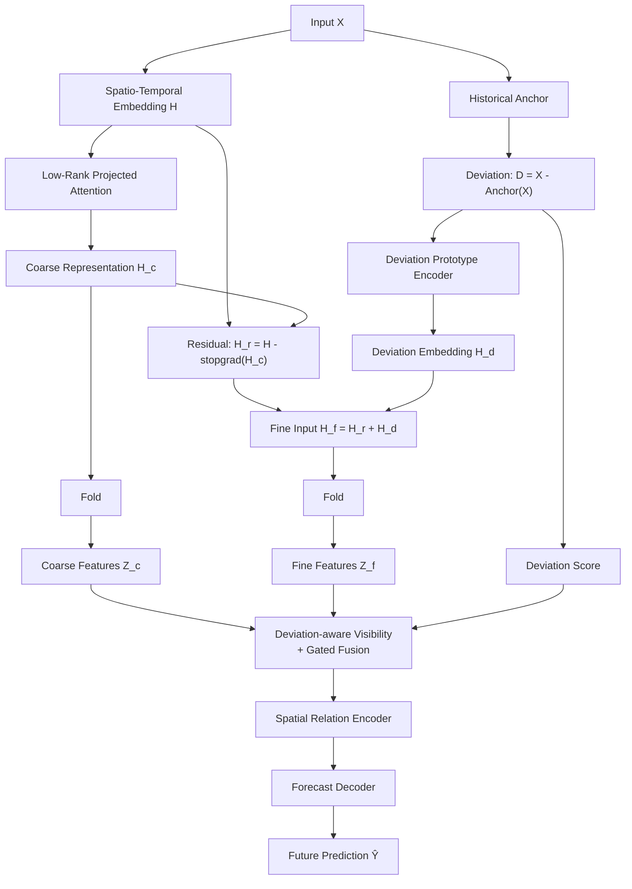

# DeCoF 时空序列预测架构设计

> 本文档根据当前架构草图整理，用于说明模型的设计动机、数据流、核心模块、数学定义、训练目标和实现接口。文中的 `Fold`、历史锚点（Historical Anchor）以及偏差感知可见性（Deviation-aware Visibility）属于可配置组件；其最终形式可在实验阶段进一步确定。

## 1. 任务定义

给定一段历史时空观测序列：

$$
X = \{X_{t-T_{in}+1}, \ldots, X_t\}
\in \mathbb{R}^{B\times T_{in}\times N\times C_x},
$$

模型预测未来连续多个时间步：

$$
\hat{Y} = \{\hat{X}_{t+1}, \ldots, \hat{X}_{t+T_{out}}\}
\in \mathbb{R}^{B\times T_{out}\times N\times C_y}.
$$

其中：

| 符号 | 含义 |
| --- | --- |
| $B$ | 批大小 |
| $T_{in}$ | 输入历史窗口长度 |
| $T_{out}$ | 预测时间窗口长度 |
| $N$ | 空间节点、传感器或区域数量 |
| $C_x$ | 输入变量数 |
| $C_y$ | 预测变量数 |
| $d$ | 隐表示维度 |
| $K$ | 偏差原型数量 |

该任务的难点通常来自两类成分：

1. **稳定的低频规律**：周期、趋势、常态空间相关性等，适合由粗粒度分支建模。
2. **局部的高频偏差**：突发事件、状态切换、异常扰动和局部非平稳变化等，需要细粒度分支重点建模。

本架构的核心思想是将输入表示分解为“粗粒度常态成分”和“细粒度偏差成分”，并使用相对于历史锚点的偏差，动态控制不同节点和时间位置间的信息交互与两条分支的融合。

## 2. 总体架构



从功能上看，模型可以划分为五个阶段：

1. **统一时空表征**：将原始序列映射为隐空间表示 $H$。
2. **粗细分解**：低秩注意力提取粗粒度成分 $H_c$，残差与偏差原型共同构成细粒度输入 $H_f$。
3. **分支内编码**：分别对 $H_c$ 和 $H_f$ 执行 `Fold`，得到 $Z_c$ 和 $Z_f$。
4. **偏差感知交互**：利用偏差分数生成可见性或交互权重，并通过门控机制融合粗细特征。
5. **空间关系与预测**：显式编码节点关系，最后解码未来序列。

## 3. 端到端数据流

设输入为 $X$，完整前向过程可概括为：

$$
\begin{aligned}
H &= \operatorname{STEmbed}(X), \\
H_c &= \operatorname{LRPA}(H), \\
A &= \operatorname{Anchor}(X), \\
D &= X-A, \\
(H_d, s_d) &= \operatorname{ProtoEnc}(D), \\
H_r &= H-\operatorname{stopgrad}(H_c), \\
H_f &= H_r+H_d, \\
Z_c &= \operatorname{Fold}_c(H_c), \\
Z_f &= \operatorname{Fold}_f(H_f), \\
V &= \operatorname{Visibility}(s_d), \\
Z &= \operatorname{GatedFusion}(Z_c,Z_f,s_d,V), \\
Z_s &= \operatorname{SpatialRelationEncoder}(Z;V), \\
\hat{Y} &= \operatorname{ForecastDecoder}(Z_s).
\end{aligned}
$$

这里的 $s_d$ 是偏差强度、偏差置信度或偏差新颖度分数。它不仅可以参与融合，也可用于控制节点之间或时间片之间的可见性。

## 4. 模块详细设计

### 4.1 Spatio-Temporal Embedding

时空嵌入模块将原始数值、时间信息和空间身份统一映射到 $d$ 维隐空间：

$$
H = E_x(X) + E_t(T) + E_s(S) + E_{aux}(X_{aux}).
$$

各部分可包括：

- **数值嵌入 $E_x$**：线性层、1D 卷积或小型 MLP，用于将 $C_x$ 维输入映射到 $d$ 维。
- **时间嵌入 $E_t$**：时间步位置、小时、星期、月份、节假日等信息。
- **空间嵌入 $E_s$**：可学习节点向量、节点坐标编码或由静态图结构得到的节点表示。
- **辅助变量嵌入 $E_{aux}$**：天气、事件、道路属性等外部特征；没有外部变量时可省略。

推荐保持输出形状为：

$$
H\in\mathbb{R}^{B\times T_{in}\times N\times d}.
$$

为减少不同量纲带来的优化困难，输入应使用仅基于训练集统计量的标准化参数进行归一化。时间嵌入和节点嵌入可在相加前经过独立投影，使各部分尺度可控。

### 4.2 Low-Rank Projected Attention

低秩投影注意力负责从统一表示 $H$ 中提取平滑、稳定且具有全局性的粗粒度表征 $H_c$。其关键假设是：常态时空模式通常位于一个相对低维的子空间中。

先将参与注意力的时空维展平为长度 $L=T_{in}N$ 的 token 序列：

$$
\bar{H}\in\mathbb{R}^{B\times L\times d}.
$$

一种可实现形式为：

$$
\begin{aligned}
Q &= \bar{H}W_Q,\\
K_r &= P_K(\bar{H}W_K),\\
V_r &= P_V(\bar{H}W_V),\\
\bar{H}_c &= \operatorname{softmax}\left(\frac{QK_r^\top}{\sqrt{d_h}}\right)V_r,\\
H_c &= \operatorname{Reshape}(\bar{H}_cW_O).
\end{aligned}
$$

其中 $P_K,P_V$ 将 token 长度从 $L$ 投影到秩 $r$，且 $r\ll L$。这样，注意力的主要复杂度由标准自注意力的 $O(L^2d)$ 降为近似 $O(Lrd)$。

低秩投影可以采用以下形式：

- 对 token 维使用可学习投影矩阵；
- 时间和空间分别进行低秩分解；
- 使用池化、诱导点或 Nyström 近似；
- 对注意力权重或特征矩阵施加显式低秩约束。

该模块的目标不只是降低计算量，更重要的是形成一个**信息瓶颈**：限制粗分支只保留主要变化模式，避免其过度吸收局部高频扰动。

### 4.3 Historical Anchor

历史锚点用于估计当前输入在正常历史规律下应处于的基准状态：

$$
A = \operatorname{Anchor}(X), \qquad D=X-A.
$$

锚点的选择应与数据周期和采样频率相匹配，常用实现包括：

1. **周期锚点**：取前一天、前一周相同时刻，或多个对应周期的均值。
2. **移动统计锚点**：滑动均值、中位数、指数移动平均或局部趋势。
3. **可学习锚点**：使用轻量网络根据更长历史生成基准值。
4. **混合锚点**：对周期锚点、趋势锚点和可学习锚点进行加权。

例如，多周期锚点可写为：

$$
A_t=\sum_{p\in\mathcal{P}}\alpha_pX_{t-p},
\qquad \alpha_p\ge 0,\quad \sum_p\alpha_p=1.
$$

实现时必须处理历史不足和缺失值问题。建议同时维护一个有效性掩码 $M_A$，无可靠锚点的位置不应产生虚假的大偏差。锚点本身也应只使用预测时刻之前可获得的数据，防止未来信息泄漏。

### 4.4 Deviation Prototype Encoder

偏差 $D$ 描述当前观测相对历史基准的变化。原型编码器通过一组可学习原型，提取可重复的偏差模式，例如局部上升、局部下降、传播性扰动或区域同步变化。

首先将偏差投影到原型空间：

$$
U=\phi_D(D)\in\mathbb{R}^{B\times T_{in}\times N\times d_p}.
$$

设原型字典为：

$$
P=\{p_1,\ldots,p_K\},\qquad p_k\in\mathbb{R}^{d_p}.
$$

通过相似度进行软分配：

$$
a_k=\frac{\exp(\operatorname{sim}(U,p_k)/\tau)}
{\sum_{j=1}^{K}\exp(\operatorname{sim}(U,p_j)/\tau)},
$$

再重构偏差语义并映射到主干维度：

$$
H_d=W_d\left(\sum_{k=1}^{K}a_kp_k\right),
\qquad H_d\in\mathbb{R}^{B\times T_{in}\times N\times d}.
$$

为了避免偏差幅值信息在原型匹配中丢失，可将原始偏差投影、原型重构和偏差幅值拼接：

$$
H_d=W_h\left[U;\sum_ka_kp_k;|D|\right].
$$

偏差分数 $s_d$ 可以有不同含义：

- **幅值分数**：$s_{mag}=\|D\|$；
- **标准化偏差**：$s_{std}=\frac{|D|}{\sigma_{hist}+\epsilon}$；
- **原型新颖度**：$s_{nov}=1-\max_k a_k$，表示偏差不能被已有原型解释的程度；
- **重构误差**：$s_{rec}=\left\|U-\sum_ka_kp_k\right\|$；
- **混合分数**：由上述多种分数经 MLP 或加权得到。

推荐首先使用“标准化偏差 + 原型新颖度”的组合，因为单纯的绝对偏差会对不同节点的自然波动尺度过于敏感。

### 4.5 残差解耦与停止梯度

粗粒度表示生成后，模型计算：

$$
H_r = H-\operatorname{stopgrad}(H_c).
$$

`stopgrad` 在前向传播中是恒等映射，但在反向传播中阻断经过该操作数的梯度。因此：

- 前向值仍然是 $H-H_c$；
- 细分支的损失可以更新时空嵌入和细分支参数；
- 细分支不能通过残差减法直接驱动粗分支改变 $H_c$。

其作用是减轻两条分支之间的梯度竞争。否则细分支可能迫使粗分支生成一种“更容易被相减”的表示，而不是稳定的粗粒度模式。

需要注意：`stopgrad` 并不会自动保证 $H_c$ 与 $H_r$ 完全正交，也不会自动防止两条分支学到重复信息。若实验中出现分支坍缩，可增加分支去相关或正交约束。

### 4.6 Fine Input

细粒度输入由嵌入空间残差和偏差原型表示共同组成：

$$
H_f=H_r+H_d.
$$

两部分分别提供：

- $H_r$：未被粗粒度表示解释的上下文信息；
- $H_d$：由原始值相对历史锚点的偏差得到的显式变化语义。

直接相加要求二者形状和数值尺度一致。实际实现中建议先使用 LayerNorm 和可学习缩放：

$$
H_f=\operatorname{LN}(H_r)+\lambda_d\operatorname{LN}(H_d),
$$

其中 $\lambda_d$ 可以是标量、通道向量，或由偏差分数动态生成的门控系数。

### 4.7 Fold：分支内的结构化编码

架构图将两条分支统一表示为：

$$
Z_c=\operatorname{Fold}_c(H_c),\qquad
Z_f=\operatorname{Fold}_f(H_f).
$$

本文将 `Fold` 定义为一个**保持批维和节点语义、对时空上下文进行重组与编码的通用算子**。其输入输出接口应明确为：

$$
\operatorname{Fold}:\mathbb{R}^{B\times T\times N\times d}
\rightarrow\mathbb{R}^{B\times T'\times N\times d_z}.
$$

可选实现包括：

- **时间折叠**：按窗口切分时间轴，将局部时间片合并为 patch；
- **多尺度折叠**：将不同时间尺度的特征逐层聚合；
- **轴向编码**：交替沿时间维和空间维执行注意力或卷积；
- **层级编码器**：通过下采样扩大感受野，再保留跳跃连接；
- **频率折叠**：将低频和高频带分别压缩后送入对应分支。

粗细分支可以共享 `Fold` 的网络结构，但通常不应完全共享参数，因为两者承担的频率和语义角色不同。推荐的归纳偏置是：

- 粗分支使用更大窗口、更强下采样或更长感受野；
- 细分支使用更小窗口、较弱下采样，并保留局部变化。

如果后续研究中的 `Fold` 指某个特定算法，应将本节替换为该算法的精确定义，并说明是否改变 $T$、$N$ 或通道维度。

### 4.8 Deviation-aware Visibility

偏差感知可见性的目标是根据偏差状态，决定哪些 token 或节点之间允许直接交换信息，以及交换信息的强度。它可表现为二值掩码，也可表现为连续注意力偏置。

设偏差分数为 $s_d$，可构造可见性矩阵：

$$
V_{ij}=g_v(s_{d,i},s_{d,j},e_i,e_j),
\qquad V_{ij}\in[0,1],
$$

其中 $e_i,e_j$ 是节点或 token 表示。连续可见性可以作为注意力偏置：

$$
\operatorname{Attn}(Q,K,V_f)=
\operatorname{softmax}\left(
\frac{QK^\top}{\sqrt{d_h}}+\beta\log(V+\epsilon)
\right)V_f.
$$

一个直观策略是：

- 低偏差区域优先使用稳定的粗粒度上下文；
- 高偏差区域增强细粒度分支，同时允许其观察空间相邻或偏差模式相似的节点；
- 两个偏差完全无关的远距离节点降低直接交互权重，减少异常噪声扩散；
- 对已知物理邻接边始终保留最低可见性，避免动态图完全破坏基础拓扑。

可见性可以由三类关系共同决定：

$$
V=\eta_1V_{static}+\eta_2V_{semantic}+\eta_3V_{deviation},
$$

其中 $V_{static}$ 来自固定图，$V_{semantic}$ 来自特征相似性，$V_{deviation}$ 来自偏差分数或原型分配。各项可通过归一化权重或可学习门控组合。

### 4.9 Gated Fusion

门控融合根据当前偏差状态，在粗分支 $Z_c$ 与细分支 $Z_f$ 之间进行动态选择。先保证两条分支具有相同形状；若不同，则分别投影和上采样至公共空间。

一种基础实现为：

$$
G=\sigma\left(operatorname{MLP}([Z_c;Z_f;s_d])\right),
$$

$$
Z=(1-G)\odot Z_c+G\odot Z_f.
$$

门控 $G$ 可以是：

- 每个样本一个标量；
- 每个时间步或节点一个标量；
- 每个 token、每个通道一个向量。

粒度越细，表达力越强，但也越容易过拟合。建议初版使用“每个时间步、每个节点一个门控值”，随后通过消融实验比较通道级门控。

为了让门控具有明确解释，可加入偏差单调性约束，使偏差较大时细分支权重整体倾向增大。但不宜将规则完全写死，因为某些大偏差可能是噪声，仍需要粗分支提供稳健基线。

偏差感知可见性与门控融合的分工是：

- **可见性**控制“与谁交互”；
- **门控**控制“粗细信息各占多少”。

### 4.10 Spatial Relation Encoder

融合后的特征进入空间关系编码器，建模节点间的静态和动态依赖。其输入为：

$$
Z\in\mathbb{R}^{B\times T'\times N\times d_z}.
$$

空间关系可以来自：

- 物理邻接矩阵，例如道路连接、地理距离；
- 统计关系，例如历史相关系数；
- 可学习节点嵌入生成的自适应图；
- 当前状态或偏差模式生成的动态图；
- 上一节得到的偏差感知可见性矩阵。

一种关系注意力形式为：

$$
R_{ij}=b_{static,ij}+b_{dynamic,ij}+b_{deviation,ij},
$$

$$
Z_s=\operatorname{softmax}\left(
\frac{QK^\top}{\sqrt{d_h}}+R
\right)V.
$$

也可以采用图卷积、消息传递网络或扩散卷积。无论使用哪种实现，都建议保留残差连接和归一化层，以避免多层空间传播造成过平滑。

### 4.11 Forecast Decoder

预测解码器将编码后的时空表示映射到未来 $T_{out}$ 个时间步：

$$
\hat{Y}=\operatorname{Decoder}(Z_s).
$$

可选方案包括：

- **直接多步预测**：一次输出所有未来时间步，训练稳定且推理速度快；
- **自回归预测**：逐步生成未来序列，表达灵活但存在误差累积；
- **查询式解码器**：为每个未来时间步设置预测 query，与历史表示交互；
- **分布式预测**：输出均值、方差或分位数，用于不确定性估计。

初版建议使用直接多步预测或查询式非自回归解码器，以避免教师强制和推理方式不一致。最终输出层将隐维度映射至 $C_y$，并执行逆标准化得到原始量纲下的预测结果。

## 5. 粗细分支的设计逻辑

两条分支并非简单并联，而是通过“先提取粗成分，再构造细残差”的方式形成非对称分工：

| 对比项 | Coarse Branch | Fine Branch |
| --- | --- | --- |
| 输入 | $H_c$ | $H-H_c+H_d$ |
| 主要信息 | 趋势、周期、全局共性 | 局部变化、偏离、突发模式 |
| 典型感受野 | 较大 | 较小或多尺度 |
| 主要归纳偏置 | 低秩、平滑、压缩 | 残差、原型、局部敏感 |
| 对偏差分数的响应 | 偏差小时占主导 | 偏差大时权重提升 |
| 主要风险 | 过度平滑 | 过拟合噪声 |

这种结构希望同时解决两个冲突目标：常态时期预测应保持平稳，异常或状态切换时期又应具备足够响应速度。

## 6. 损失函数与训练约束

### 6.1 主预测损失

点预测可以使用 MAE、Huber 或 MSE。对含突发扰动的数据，推荐以 MAE 或 Huber 为主：

$$
\mathcal{L}_{pred}=\frac{1}{|\Omega|}
\sum_{(b,t,n,c)\in\Omega}
\rho(\hat{Y}_{btnc}-Y_{btnc}),
$$

其中 $\Omega$ 是有效标签集合，$\rho$ 为绝对误差或 Huber 函数。可以按预测步长设置权重，避免远期误差在训练中被忽略。

### 6.2 可选辅助损失

以下损失不是架构运行的硬性要求，应通过消融实验决定是否保留。

**原型重构损失**：

$$
\mathcal{L}_{proto}=\left\|U-\sum_ka_kp_k\right\|_1.
$$

它使原型能够覆盖常见偏差模式。

**原型多样性损失**：

$$
\mathcal{L}_{div}=\sum_{i\ne j}
\max(0,\operatorname{cos}(p_i,p_j)-m).
$$

它减少多个原型收敛到相同方向的风险。

**分支去相关损失**：

$$
\mathcal{L}_{decorr}=
\left\|\operatorname{Cov}(Z_c,Z_f)\right\|_F^2.
$$

它鼓励粗细分支学习互补信息，但权重过大可能损害共享语义。

**门控正则**：可惩罚门控长期饱和在 0 或 1，或约束批次平均门控与偏差强度保持合理相关。

总损失可写为：

$$
\mathcal{L}=\mathcal{L}_{pred}
+\lambda_{proto}\mathcal{L}_{proto}
+\lambda_{div}\mathcal{L}_{div}
+\lambda_{decorr}\mathcal{L}_{decorr}
+\lambda_{gate}\mathcal{L}_{gate}.
$$

所有辅助权重应从较小值开始，并报告超参数敏感性。

## 7. 推荐的前向接口

下面的伪代码只规定模块边界，不绑定具体深度学习框架：

```python
def forward(x, time_features, node_features, anchor_context, masks=None):
    # x: [B, T_in, N, C_x]
    h = st_embedding(x, time_features, node_features)

    # Coarse representation
    h_c = low_rank_projected_attention(h)

    # Explicit deviation representation
    anchor, anchor_mask = historical_anchor(x, anchor_context)
    deviation = (x - anchor) * anchor_mask
    h_d, deviation_score, prototype_weight = deviation_encoder(deviation)

    # stop_gradient affects backward only
    h_r = h - stop_gradient(h_c)
    h_f = norm_r(h_r) + deviation_scale * norm_d(h_d)

    # Branch-specific structured encoding
    z_c = coarse_fold(h_c)
    z_f = fine_fold(h_f)

    # Align temporal resolution and channels if necessary
    z_c, z_f, deviation_score = align(z_c, z_f, deviation_score)

    visibility = build_visibility(deviation_score, prototype_weight, masks)
    z = gated_fusion(z_c, z_f, deviation_score, visibility)
    z = spatial_relation_encoder(z, visibility)
    y_hat = forecast_decoder(z)

    aux = {
        "anchor": anchor,
        "deviation": deviation,
        "deviation_score": deviation_score,
        "prototype_weight": prototype_weight,
        "visibility": visibility,
    }
    return y_hat, aux
```

建议模型在训练和评估时返回 `aux`，便于检查原型使用率、门控分布、可见性稀疏度和偏差分数，提升科研实验的可解释性与可复现性。

## 8. 张量形状参考

假设两条 `Fold` 分支最终对齐到相同的 $T'$ 和 $d_z$：

| 张量 | 推荐形状 | 说明 |
| --- | --- | --- |
| $X$ | $[B,T_{in},N,C_x]$ | 原始历史输入 |
| $H$ | $[B,T_{in},N,d]$ | 时空嵌入 |
| $H_c$ | $[B,T_{in},N,d]$ | 粗粒度表示 |
| $A$ | $[B,T_{in},N,C_x]$ | 历史锚点 |
| $D$ | $[B,T_{in},N,C_x]$ | 显式偏差 |
| $H_d$ | $[B,T_{in},N,d]$ | 偏差嵌入 |
| $H_r$ | $[B,T_{in},N,d]$ | 表示残差 |
| $H_f$ | $[B,T_{in},N,d]$ | 细分支输入 |
| $Z_c$ | $[B,T',N,d_z]$ | 粗分支输出 |
| $Z_f$ | $[B,T',N,d_z]$ | 细分支输出 |
| $s_d$ | $[B,T',N,1]$ | 对齐后的偏差分数 |
| $G$ | $[B,T',N,1]$ 或 $[B,T',N,d_z]$ | 融合门控 |
| $V$ | 依实现而定 | token 或节点可见性矩阵 |
| $\hat{Y}$ | $[B,T_{out},N,C_y]$ | 未来预测 |

如果空间关系编码仅在每个时间切片的节点间执行，$V$ 可采用 $[B,T',N,N]$；如果执行完整时空注意力，则可使用 $[B,L',L']$，其中 $L'=T'N$，但内存开销会显著增大。

## 9. 训练与实现注意事项

### 9.1 数据泄漏

- 标准化统计量只能由训练集计算。
- 历史锚点不能读取预测起点之后的数据。
- 构造按日或按周周期锚点时，应保证验证集和测试集仅引用其时间之前已存在的观测。
- 缺失值插补也必须遵守因果性，尤其不能使用双向插值跨越预测边界。

### 9.2 缺失数据

输入掩码、锚点有效性掩码和标签掩码应分开维护。偏差应按以下方式计算：

$$
D=(X-A)\odot M_X\odot M_A.
$$

同时可将掩码作为额外输入特征，让模型区分真实零值和缺失填充值。

### 9.3 数值稳定性

- 对标准化偏差中的方差增加 $\epsilon$。
- 计算可见性的对数偏置时对 $V$ 做截断。
- 对低秩注意力和空间编码器使用 LayerNorm、残差连接和适当的梯度裁剪。
- 监控 $H_c$、$H_r$ 和 $H_d$ 的范数，避免某一项完全支配 $H_f$。

### 9.4 原型坍缩

应记录每个原型的平均分配概率和被选频率。如果少数原型长期占据全部样本，可采用原型多样性正则、分配熵正则、温度退火、EMA 原型更新或重新初始化闲置原型。

### 9.5 门控退化

训练早期门控可能迅速饱和，使其中一条分支失去梯度。可采用门控偏置初始化、温度参数、短期 warm-up 或轻量的平衡正则。门控输出应作为实验可视化的重要对象。

### 9.6 复杂度控制

完整时空 token 数为 $L=T_{in}N$。需要重点控制：

- 低秩注意力秩 $r$；
- `Fold` 后的时间长度 $T'$；
- 可见性矩阵的稀疏度；
- 空间关系编码器是稠密 $N^2$ 交互还是稀疏邻接交互。

对于节点数较大的数据集，推荐在空间关系编码中保留 top-k 邻居或使用块稀疏策略。

## 10. 实验与消融设计

为了验证各模块是否真正发挥预期作用，至少应包含以下消融：

| 编号 | 实验 | 验证目标 |
| --- | --- | --- |
| A0 | 完整模型 | 主结果 |
| A1 | 移除偏差原型，仅保留 $H_r$ | 原型语义是否有效 |
| A2 | 移除残差，仅使用 $H_d$ 作为细分支 | 表示残差是否必要 |
| A3 | 去除 `stopgrad` | 梯度解耦的作用 |
| A4 | 低秩注意力替换为普通注意力 | 低秩瓶颈与计算效率 |
| A5 | 历史锚点替换为零或移动均值 | 锚点设计的贡献 |
| A6 | 偏差感知可见性替换为全可见 | 动态交互限制的贡献 |
| A7 | 门控融合替换为相加或拼接 | 自适应粗细选择的贡献 |
| A8 | 移除空间关系编码器 | 显式空间建模的贡献 |
| A9 | 粗细分支共享 `Fold` 参数 | 分支专用编码是否必要 |

除总体 MAE、RMSE、MAPE 或 WAPE 外，建议按偏差强度将测试样本划分为低、中、高偏差子集，分别报告性能。否则模型对突发变化的提升可能被大量常态样本掩盖。

还应报告：

- 不同预测步长的误差曲线；
- 参数量、训练显存、单批次推理时间；
- 原型使用分布和代表性偏差片段；
- 偏差分数与预测误差的相关性；
- 门控值随偏差强度的变化；
- 动态可见性与真实空间关系或事件传播的对应情况。

## 11. 可解释性分析

该架构天然提供多种可解释信号：

1. **历史锚点**：展示模型认定的常态参考值。
2. **偏差曲线**：展示观测相对常态的变化方向与幅度。
3. **原型分配**：说明当前偏差最接近哪类已学习模式。
4. **粗细门控**：说明预测在何时、何地更依赖常态或局部偏差。
5. **可见性矩阵**：说明偏差发生时模型允许哪些区域交换信息。
6. **空间关系权重**：说明最终预测依赖的节点关系。

科研报告中应优先展示“输入—锚点—偏差—原型—门控—预测”的完整案例，而不只展示注意力热图。这样可以检验模型解释是否与真实时空事件一致。

## 12. 当前待确定的研究选择

根据现有架构图，以下事项仍需在实现前明确：

1. 历史锚点使用固定周期统计、可学习模块，还是二者混合。
2. 低秩投影作用于联合时空 token，还是分别作用于时间维和空间维。
3. `Fold` 的精确定义、窗口大小、是否下采样，以及两条分支是否使用不同尺度。
4. 偏差分数采用幅值、标准化幅值、原型新颖度、重构误差还是混合形式。
5. 可见性是硬掩码还是连续偏置，以及它作用于融合前、空间编码中或两者同时。
6. 空间关系编码器使用固定图、自适应图、动态图注意力还是混合关系。
7. 解码器采用直接多步、查询式还是自回归形式。
8. 训练目标是否包含原型、分支解耦和门控正则。

这些选择应在统一数据划分和训练预算下通过验证集与消融实验确定，而不应仅依据主测试集结果进行选择。

## 13. 架构总结

DeCoF 的整体逻辑可以概括为：

> 先用低秩注意力从时空嵌入中抽取稳定的粗粒度模式，再将未被粗表示解释的残差与相对历史锚点的偏差原型结合为细粒度输入；随后分别编码两条分支，利用偏差分数动态决定信息可见范围和粗细融合比例，最后通过空间关系编码与预测解码器生成未来序列。

该设计的潜在优势在于同时具备全局稳定性、局部敏感性、计算可控性和一定的可解释性。其性能关键不只取决于单个模块的复杂度，更取决于历史锚点是否可靠、粗细分支是否真正形成互补，以及偏差信号能否有效控制信息交互与融合。
